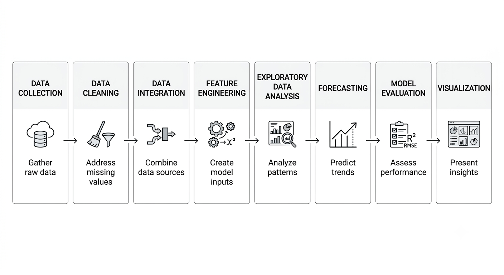
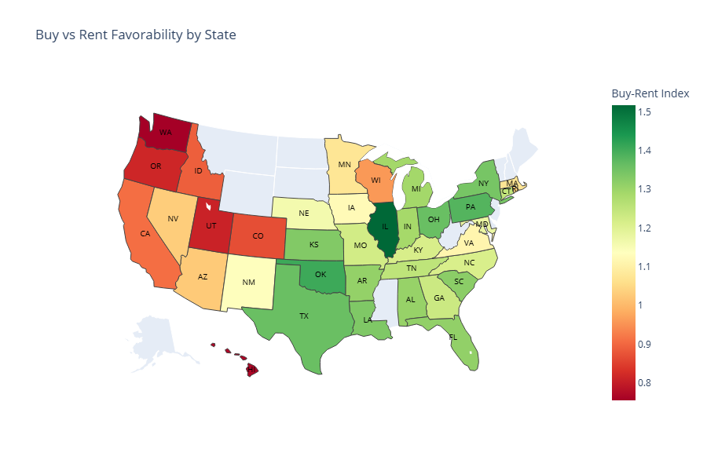
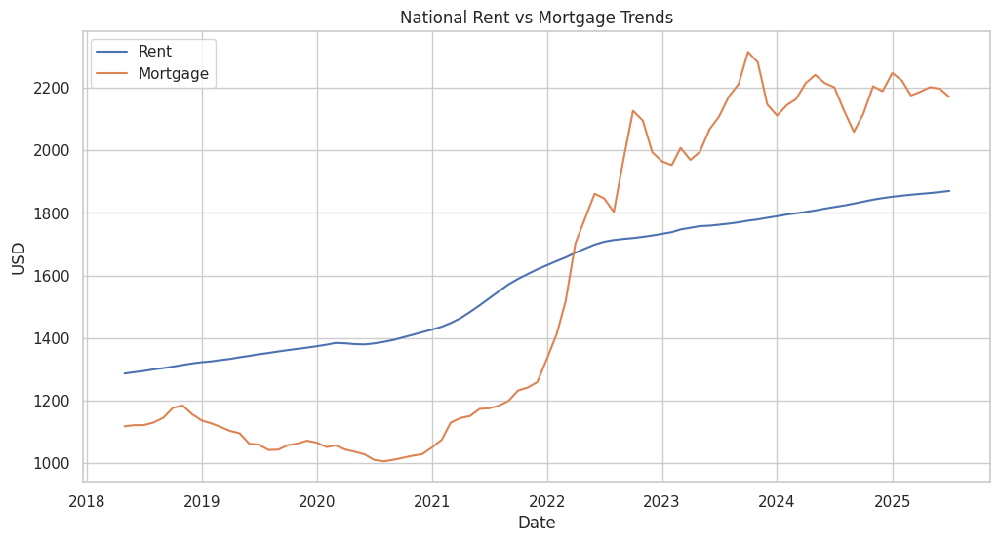
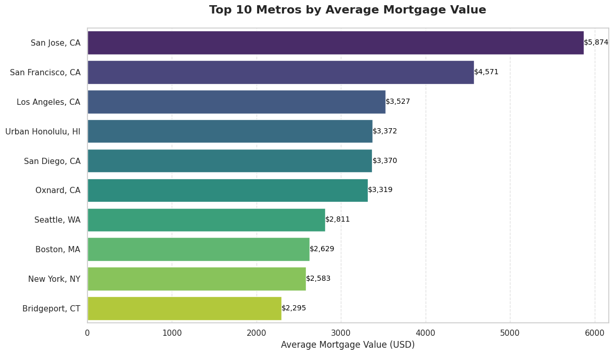
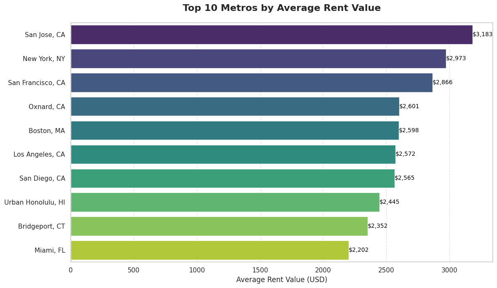
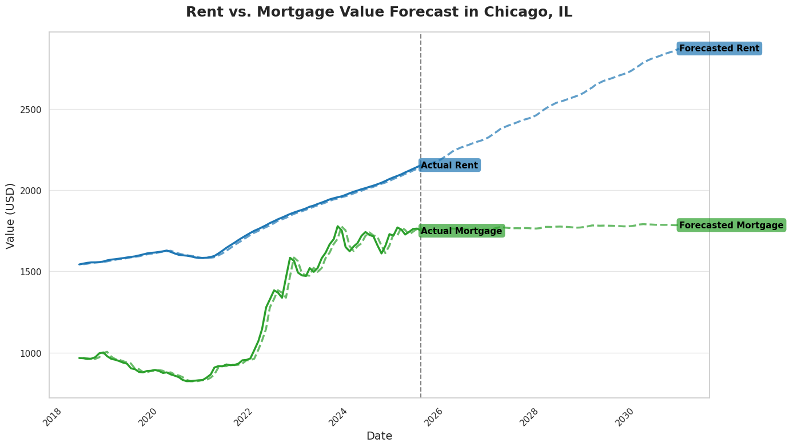
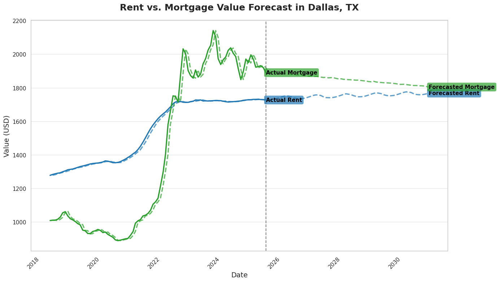

# Forecasting Rent and Mortgage Trends in U.S. Housing Markets Using Machine Learning

> A machine learning framework for forecasting rent and mortgage trends across U.S. metropolitan areas using Zillow housing data and Federal Reserve (FRED) macroeconomic indicators.

---

## Overview

Housing affordability has become one of the biggest economic challenges in the United States. Rising home prices, increasing mortgage rates, and changing rental markets make it difficult for individuals, investors, and policymakers to make informed housing decisions.

This project develops a complete machine learning pipeline that integrates housing market data from **Zillow Research** with macroeconomic indicators from **FRED** to forecast future rent and mortgage costs across U.S. metropolitan areas.

The project evaluates multiple forecasting models and compares their predictive performance using standard regression metrics.

---

## Key Results

- **92 U.S. metropolitan areas** analyzed
- **7 years of monthly housing data** (2018–2025)
- **27 engineered features** capturing temporal and economic trends
- **4 forecasting models** evaluated (Prophet, Linear Regression, XGBoost, LSTM)
- **Prophet achieved the best performance**, with MAE of **15.24** (rent) and **12.09** (mortgage)
- Interactive visualizations of housing affordability and metro-level forecasts

---

## Features

- End-to-end data engineering pipeline
- Integration of Zillow + FRED datasets
- Data cleaning and preprocessing
- Feature engineering with temporal variables
- Geographic housing affordability visualization
- Time-series forecasting
- Model comparison and evaluation
- Interactive dashboard (Streamlit)

---

## Dataset

### Zillow Research

- Zillow Home Value Index (ZHVI)
- Zillow Observed Rent Index (ZORI)
- Inventory
- Sales Count
- New Construction
- Market Heat Index
- Income Needed to Buy
- Income Needed to Rent
- Monthly Mortgage Payment

### FRED

- Consumer Price Index (CPI)
- Unemployment Rate
- 30-Year Mortgage Rate

---

## Project Pipeline



The workflow consists of:

1. Data Collection
2. Data Cleaning
3. Data Integration
4. Feature Engineering
5. Exploratory Data Analysis
6. Forecasting
7. Model Evaluation
8. Visualization

---

## Feature Engineering

The project generates **27 engineered features**, including:

### Lag Features

- Previous Home Value
- Previous Rent Value
- Previous Mortgage Rate
- Previous CPI
- Previous Unemployment

### Rolling Features

- 3-Month Moving Average
- Housing Trends
- Inventory Trends

### Ratio Features

- Home Value to Income
- Mortgage Burden
- Rent to Mortgage Ratio
- Sales to Inventory

### Change Features

- Home Value Change
- Mortgage Change
- CPI Change
- Income Change

### Seasonal Features

- Month
- Month (Sin)
- Month (Cos)

---

## Machine Learning Models

The following forecasting models were evaluated:

- Prophet
- Linear Regression
- XGBoost
- LSTM

---

## Model Performance

| Model | Rent MAE | Rent RMSE | Mortgage MAE | Mortgage RMSE |
|---------|----------|------------|----------------|----------------|
| Prophet | **15.24** | **17.21** | **12.09** | **13.84** |
| Linear Regression | 25.89 | 28.28 | 47.15 | 51.68 |
| XGBoost | 41.76 | 44.65 | 66.69 | 71.95 |
| LSTM | 47.90 | 50.51 | 76.97 | 93.63 |

Prophet consistently achieved the best forecasting performance for both rent and mortgage prediction.

---

## Buy vs Rent Affordability



---

## National Housing Trends



---

## Top Metropolitan Areas

### Highest Mortgage Costs



### Highest Rent Costs



---

## Forecast Examples

### Chicago



### Dallas



---

## Installation

```bash
git clone https://github.com/yourusername/rent-vs-buy-forecasting.git
cd rent-vs-buy-forecasting
pip install -r requirements.txt
```

---

## Future Work

- Hybrid Prophet + XGBoost models
- Spatial clustering of metropolitan areas
- Deep learning sequence models
- Additional macroeconomic indicators
- Real-time dashboard deployment
- Automated monthly forecasting pipeline

---

## Authors

**Avas Bajracharya**
Graduate Research Assistant
East Tennessee State University

---

## Acknowledgements

- Zillow Research
- Federal Reserve Economic Data (FRED)
- East Tennessee State University

---

## License

This project is licensed under the MIT License.